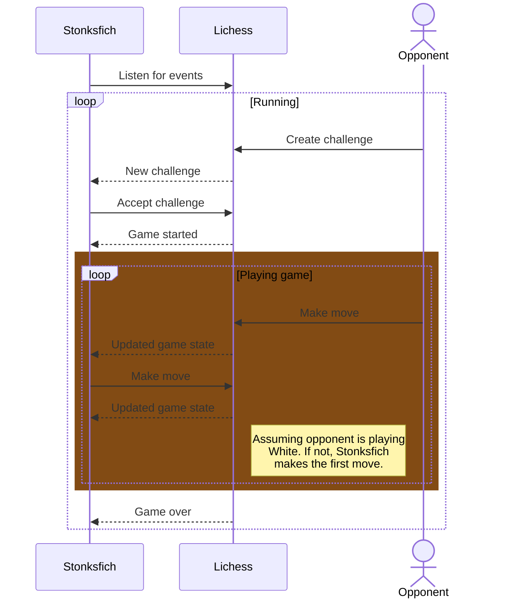

# Stonksfich

A fast chess bot playable on Lichess written in Rust.

## How to run

`RUSTFLAGS="-C target-cpu=native" cargo run`

## Dependencies

The bot uses the [Chess crate](https://github.com/jordanbray/chess) for keeping track of the game state as well as fast move generation during search and evaluation. For communication with Lichess APIs, the [Licheszter crate](https://github.com/tontsa28/licheszter) is used.

## How it works

The bot listens for events from Lichess and responds accordingly.

